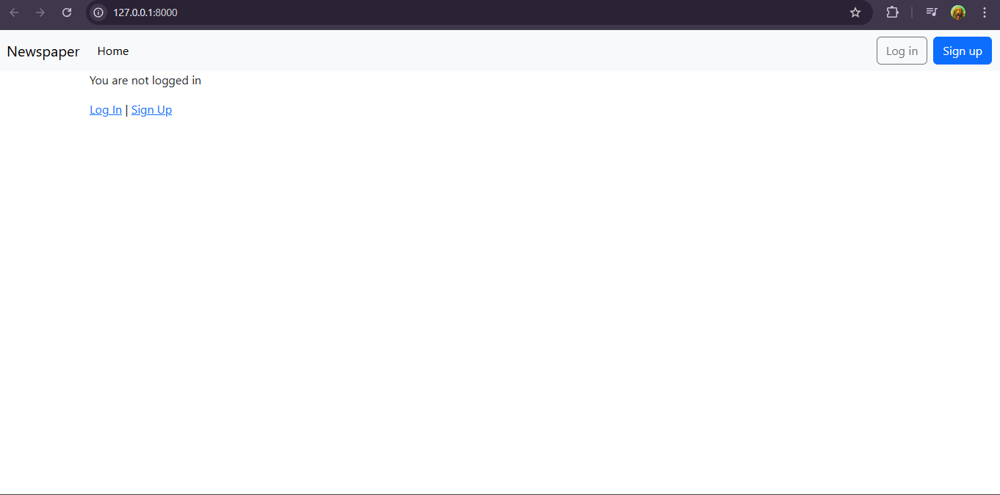
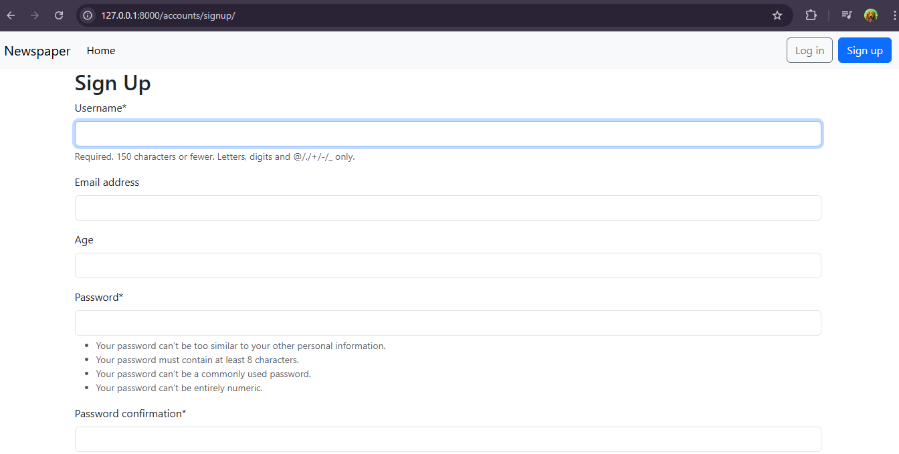
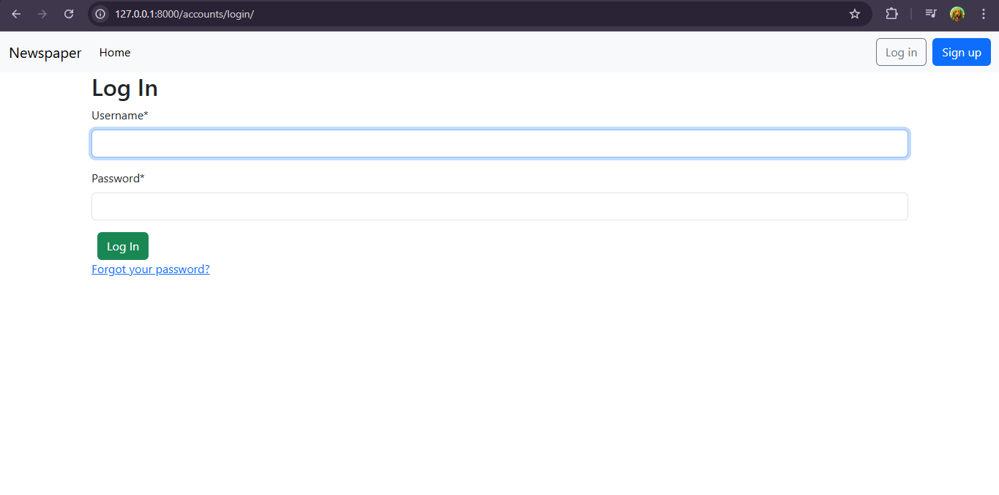
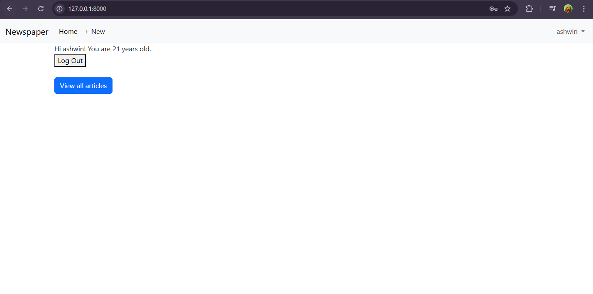
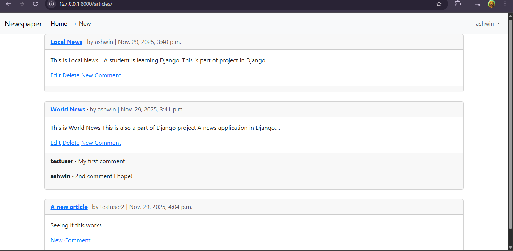
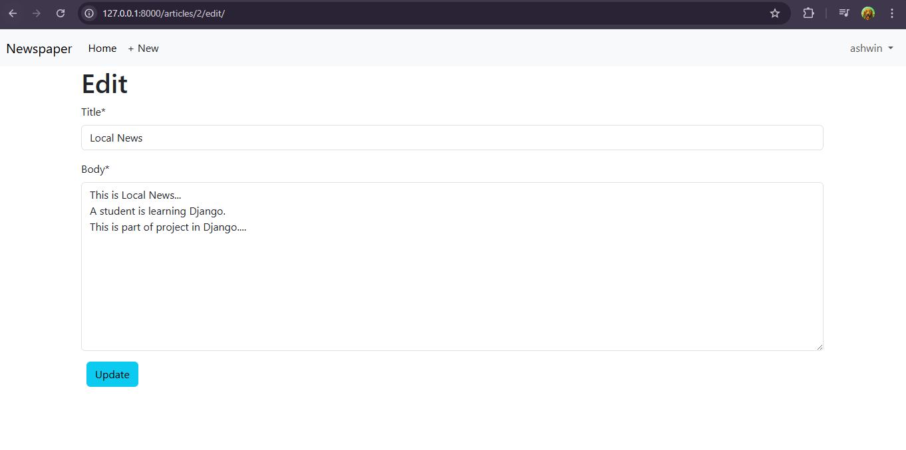
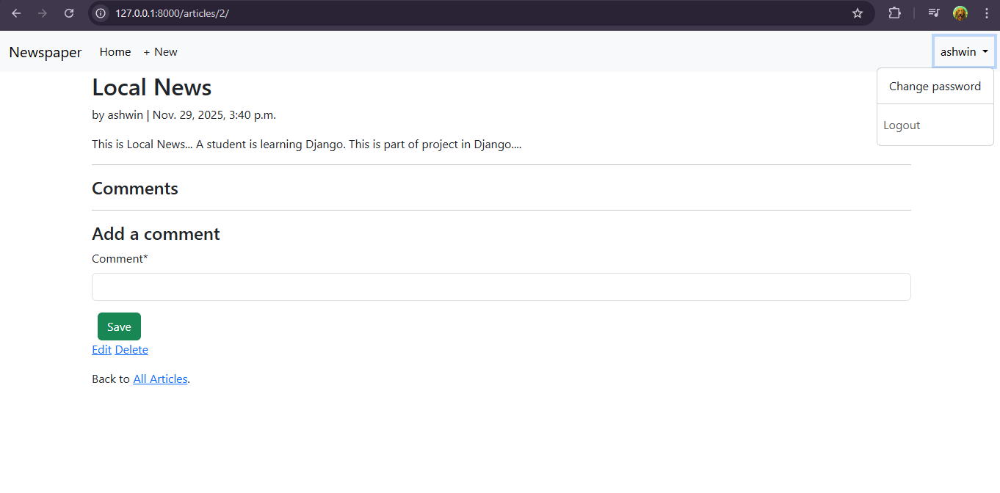
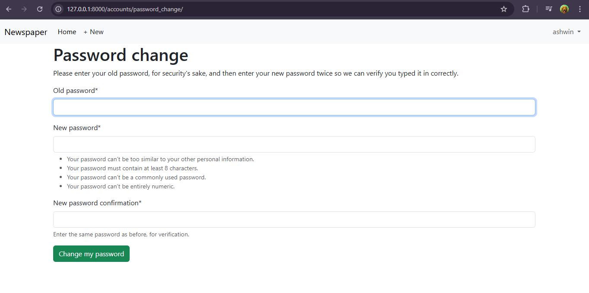

# 📰 News App (Django)


News App is a Django-based web application that fetches and displays the latest news articles from a news API. This project demonstrates my ability to build full-stack web applications, write clean and testable code, and manage environment variables securely.










and many more features, like if user has loggedIn, He/She can only edit his/her articles (like delete, edit), he/she can't edit the articles of other users... and etc..

✅ Key Features

* Fetches news from a live API

* Search functionality for articles

* Category-based filtering

* Responsive UI using Bootstrap

* Error handling for missing or invalid API keys

* Fully tested with test.py
  


🛠️ Technologies Used

* Backend: Django

* Frontend: Bootstrap

* Testing: Python unittest (test.py included)


📦 Installation & Setup

Clone the repository
```
git clone https://github.com/100ashwin/news
cd news
```

Create a virtual environment

```
python -m venv env
source env/bin/activate     # Mac/Linux
env\Scripts\activate        # Windows
```

Install dependencies

```
pip install -r requirements.txt
```

Add environment variables in a .env file

```
SECRET_KEY=your_django_secret_key
NEWS_API_KEY=your_news_api_key 
```


Run migrations

```
python manage.py migrate
```

Run the server
```
python manage.py runserver
```

🧪 Testing

* The project has been tested using test.py:
```
python test.py
```

* All tests pass successfully, confirming functionality and stability.
